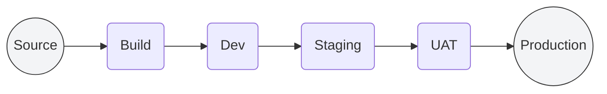

# üöÄ testing-one-git-badge | CI/CD Dashboard

> **Real-time Deployment Monitoring**
> This dashboard provides a live, visual representation of the current state of our deployment pipeline for this microservice.

### üìâ Pipeline Architecture

```mermaid
graph LR
    S((Source)) --> B(Build) --> D(Dev) --> ST(Staging) --> U(UAT) --> P((Production))
    
    style S fill:#f3f4f6,stroke:#333
    style P fill:#f3f4f6,stroke:#333
```

### üìä Live Stage Monitoring

| Stage | Activity | Current Status | Last Updated | 🔑 Commit | 👤 Author |
| :--- | :--- | :--- | :--- | :--- | :--- |
| **01. Source** | üì° Listener |  |  |  |  |
| **02. Build** | 🏗️ Compile |  |  |  |  |
| **03. Dev** | üß™ Deploy |  |  |  |  |
| **04. Staging** | üöÄ Deploy |  |  |  |  |
| **05. UAT** | üö• Review |  |  |  |  |
| **06. Production** | üíé Live |  |  |  |  |

---

### 🛡️ Smart Infrastructure
*   **Discovery**: Automatic repository & README mapping via AWS API.
*   **Performance**: Native Camo Purge Protocol for sub-second updates.
*   **Security**: Private S3 storage via CloudFront OAC.

---
*Status badges feature live **animated progress bars** during active deployments.*
